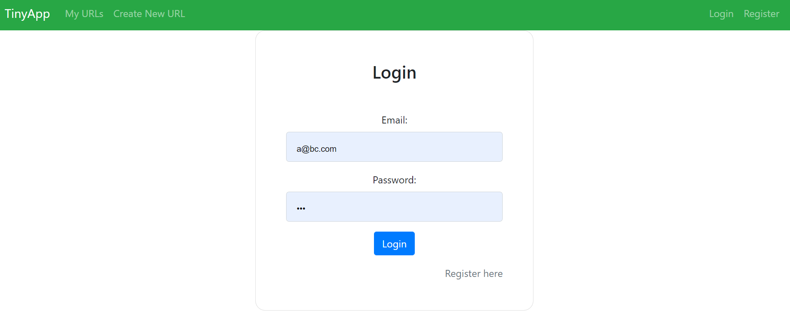

# TinyApp Project

TinyApp is a full stack web application built with Node and Express that allows users to shorten long URLs.

## Final Product

## Description
- Login, Logout and registration page
- Encrypt password prevents information leaking
- Crating a tiny URL will generate a short URL ID
- You can delete and edit the URLs
- The unique URLS created belongs to individual users (Not hackable)

## Dependencies

- Node.js
- Express
- EJS
- bcryptjs
- cookie-session
- method-override

## Getting Started

- Install all dependencies (using the `npm install` command).
- Run the development web server using the `node express_server.js` command